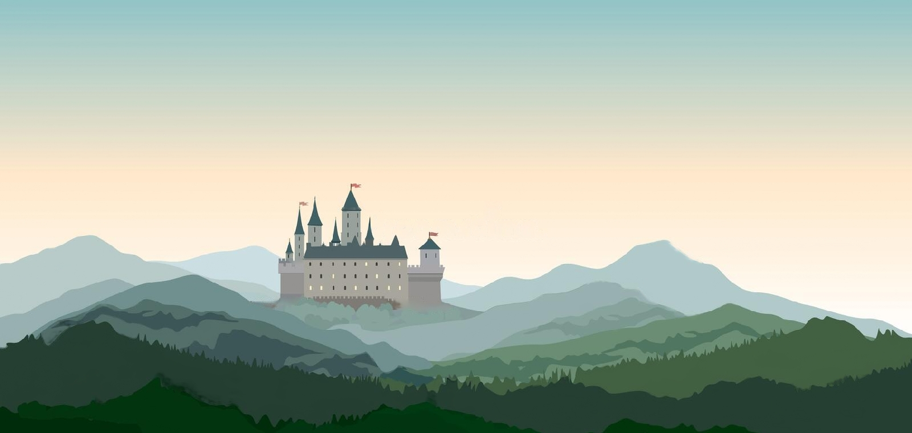
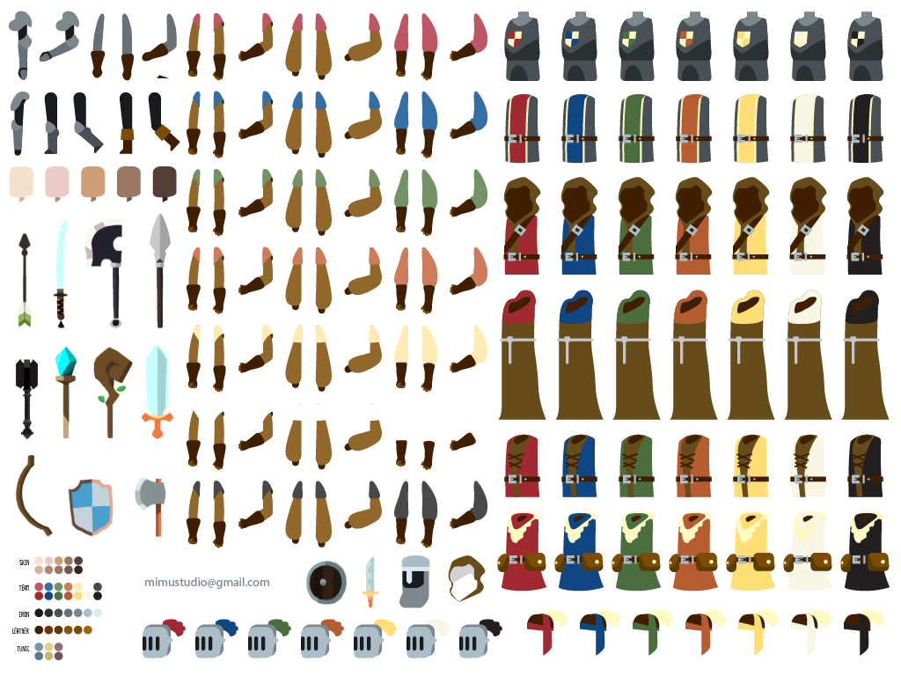

# UnitySecondProject
This is first project that i am creating on my own

## AssetList:

## To Do Plan:
- [x] Create project in Unity 5.5.6 (January 12, 2018)
- [x] Find or make some basics and character
- [x] Find or make some clothes assets for character
- [x] Add features (Sound, Buttons, other stuff)
- [x] Add something new to the project 
- [x] Build .exe file and continue working
- [x] Complete project
